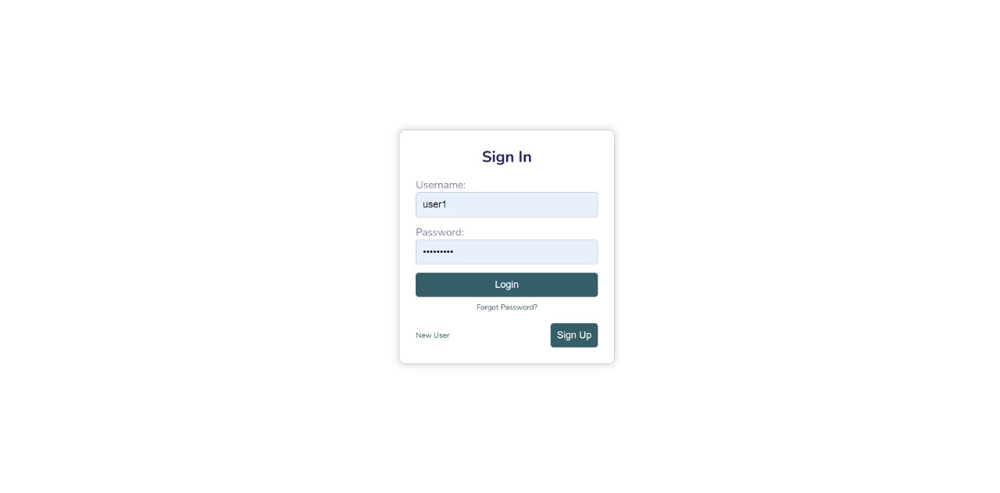
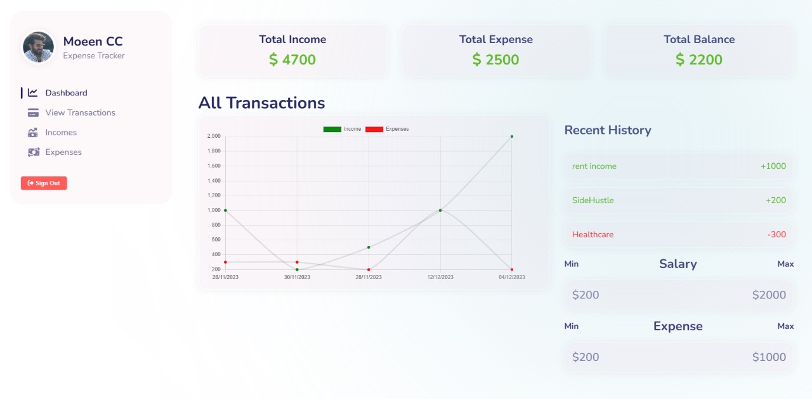
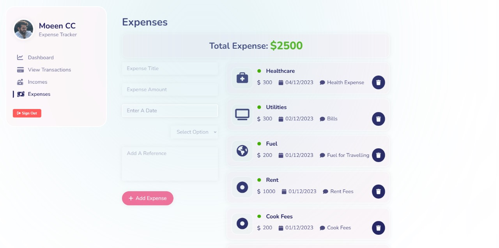

## Expense Management System

An expense management system is a tool designed to streamline the tracking, monitoring, and organization of expenses for individuals, businesses, or organizations. It offers the following key functionalities:

- **Recording Expenses:** Users can input details of various expenses, including date, amount, category (e.g., travel, utilities, supplies), and additional notes.

- **Tracking Spending:** The system allows users to monitor their spending habits, view historical data, and gain insights into where their money is being allocated.

- **Generating Reports:** Users can generate comprehensive reports and visualizations (e.g., graphs, charts) to analyze spending patterns, identify trends, and make informed financial decisions.

- **Setting Budgets:** Users can set budgets for different expense categories, receiving alerts or notifications when approaching or surpassing set limits.

- **Accessibility and Convenience:** The system typically provides a user-friendly interface accessible via desktop or mobile devices, offering easy access to expense information.

### Usefulness

An expense management system is highly beneficial for:
- Maintaining financial discipline by aligning expenses with budgets.
- Gaining insights into spending patterns for better financial planning.
- Streamlining expense-related processes, reducing manual effort and errors in financial management.

Overall, it promotes financial awareness, efficiency, and control, aiding in the better management of resources and finances.

## Group Members:
   1. Moeen Haider 24505
   2. Muhammad Faraz 25142
   3. Sarim ul Haque 24493
   4. Mirza Mustafa 24527
   5. Siddique Khatri 25135


## Installation
To set up this project, follow these steps for both the backend and frontend directories:

### Backend Installation
1. Open a terminal and navigate to the `backend` directory:
   ```bash
   cd backend
2. Install the required Node.js modules:
   ```bash
   npm i
### Frontend Installation
1. Open another terminal instance (or navigate back to the project root if needed) and go to the frontend directory:
   ```bash
   cd frontend
2. Install the necessary Node.js modules:
   ```bash
    npm i

## Login:


## Dashboard:


## Income:


## Expenses:



